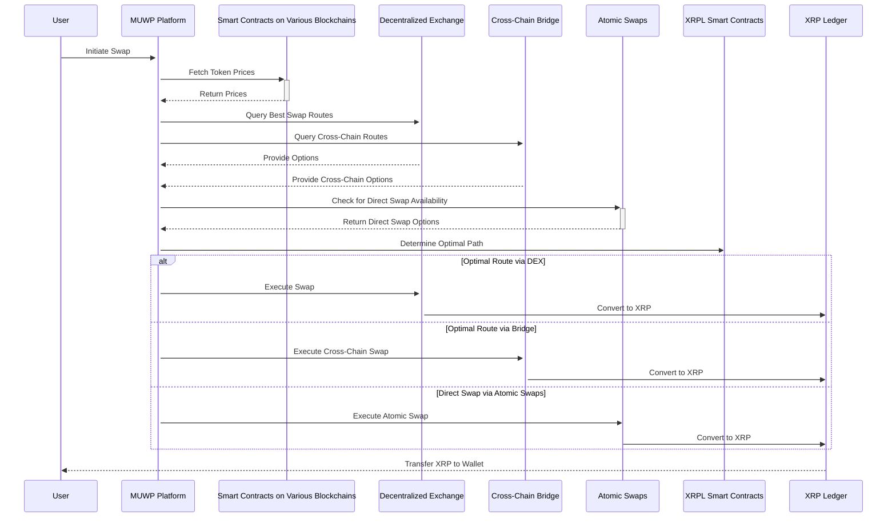

***

# Multi-Blockchain Swap Process with MUWP on the XRPL

This sequence diagram illustrates how a user performs a token swap using the Multi-Blockchain User Wallet Platform (MUWP), integrated with the XRP Ledger (XRPL). MUWP facilitates swaps across various blockchains by identifying the most optimal route for the user's exchange needs.

## Process Breakdown:

### User Initiates Swap
- **Action**: The user engages with the MUWP platform, specifying the source and destination tokens and the swap amount.

### MUWP Fetches Token Prices
- **Action**: MUWP interacts with smart contracts on various blockchains to access current token prices or exchange rates.

### Smart Contracts Return Prices
- **Response**: Smart contracts from different blockchains send back the requested token prices to MUWP.

### MUWP Queries Swap Routes
- **DEXs (Decentralized Exchanges)**: MUWP queries DEXs to discover the best trading routes within the chosen blockchain.
- **Cross-Chain Bridges**: MUWP explores potential cross-chain swaps by querying bridges that facilitate token transfers across different blockchains.

### DEX and Bridge Respond
- **DEXs**: Provide details on available swap options and their rates.
- **Bridges**: Offer information on cross-chain swap possibilities, which may involve wrapping and unwrapping tokens on different blockchains.

### MUWP Checks for Direct Swap
- **Action**: MUWP checks for the availability of direct swaps using Atomic Swaps (AS), enabling trustless peer-to-peer token exchanges without centralized intermediaries.

### AS Responds with Options
- **Response**: If direct atomic swaps are feasible, the AS module within MUWP provides details on these options.

### MUWP Determines Optimal Path
- **Analysis**: MUWP analyzes data from various sources:
  - Token prices from smart contracts.
  - Swap options and rates from DEXs.
  - Cross-chain swap options and fees from bridges.
  - Direct swap details from atomic swaps (if available).
- **Outcome**: Based on this data, MUWP determines the most efficient and cost-effective route for the swap.

### Execute Swap Based on Optimal Route
- **DEX**: Executes the swap directly through the selected DEX, possibly involving multiple token conversions.
- **Bridge**: Carries out the cross-chain swap via the selected bridge, including token wrapping and transferring.
- **Atomic Swaps**: If a direct swap is selected, MUWP facilitates the atomic swap process.

### Convert to XRP (XRP Ledger)
- **Action**: After executing the swap, MUWP converts the tokens to XRP, the native token of the XRPL.

### Transfer XRP to User's Wallet
- **Final Step**: The XRP Ledger processes the transaction and transfers the swapped XRP tokens to the user's wallet, completing the swap process.

